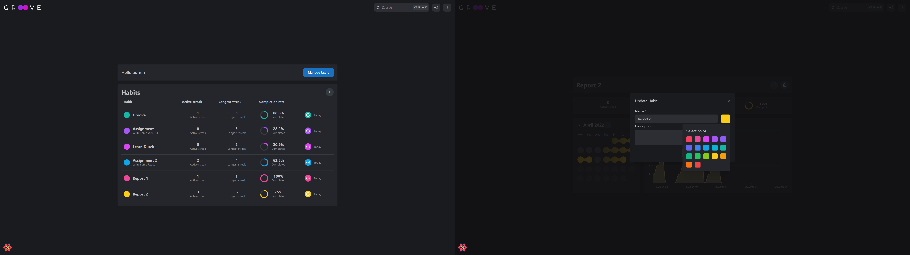
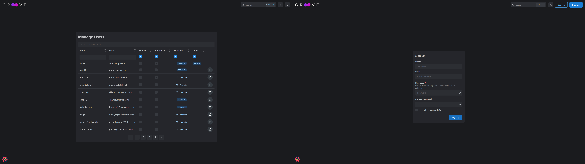
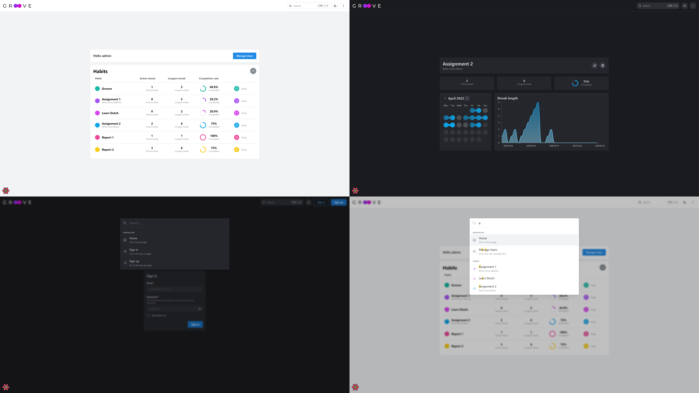

# Assignment 2

This report describes the application, notable choices and features. Furthermore it details my experience with the service aspects of WebDSL and a few JavaScript libraries I have experimented with. Overall, my learning time was about 15 minutes for the basics of WebDSL services, the other time (aroung 50 hours in total) was spent on the application.

## Groove - A Habit tracker

The main app idea is the same as for Assignment 1:

> The goal is to have a convenient way to keep track of habits and to motivate forming new habits with streaks. A user can have multiple habits, which in turn can be completed daily. Consecutive daily habit completions form streaks.

Similarly to the WebDSL counterpart, apart fromt the habit related features, the react application supports logging in, signing up and managing users.

### Architecture and Choices

The backend logic already was described in detail in the first report, so this time I will focus on the service interface and the React frontend.

For the interface, my first choice was for every endpoint to have the common route `/api` (so `/api/login` and `/api/register` instead of `/login` and `/register`) to have a clear distinction between the WebDSL application and the endpoints. Well, at least to avoid naming conflicts such as `login` or `habits`. To achieve this, I have used the `routing` features of WebDSL to reroute all `/api/<service>` requests to the corresponding service definition. With that out of the way the next choice was regarding which protocols to use. Turns out, WebDSL does not allow changing the returned HTTP status code and on errors often the HTML error pages are returned. Thus I chose to use HTTP POST with JSON bodies for everything, instead of using multiple HTTP methods. To still be able to transmit errors, each response is a JSON object with an `error` array including all the error messages. Furthermore, to differentiate between different request goals I have introduced a `_method` key for requests that is one of `QUERY`, `CREATE`, `UPDATE`, `DELETE`. Another reason for this was that WebDSL only allows a selection of HTTP methods (`GET`, `HEAD`, `POST`, `PUT`, `TRACE`, `OPTIONS`) and I wanted four different methods (I am not counting `HEAD`,`TRACE` and `OPTIONS`). On the client side, each API request is an asynchronous function (returning a Promise) that is wrapped by a function that restores errors if necessary.

On the react side of things, I opted to go with the TypeScript version of create react app.
In my opinion the benefits of type checking and great editor support is well worth the few type declarations needed when using TypeScript. Next up was the API interface, where I chose to use the library React Query for caching and state management. A benefit of this is that the api requests and their data are nicer to consume in components using hooks. No need for a `useEffect` that does the data fetching. Furthermore the state management/caching allows different and unrelated components to use the same data without repeated requests to the server. Another notable decision was to split up the react application into two parts depending on the application state. Kent C Dodds argues in [this blog post](https://kentcdodds.com/blog/authentication-in-react-applications) that this is a good idea so I wanted to try it out. Because of this, there are different routes available depending on wheter one is logged in or not.

### UI and Features

In this section the user interface is described in more detail. The following image shows the habit pages, the core of the application. On the detail page, users have an overview of their habit completions with statistics and can complete the habit. The user can view the completions on a per month basis. Only the needed completions are fetched each time and the graph displays the streak length throughout the selected month. The currently selected month is stored in a URL search parameter. This page also contains the functionality for editing and deleting habits designed similarly to the WebDSL counterpart. The overview displays summarizing stats for each habit and allows the completion of the current day without needing to go to the detail page.



The administrator has access to the management page, allowing to search, sort and filter the users. Additionally, the admin can promote non-premium users or delete users.



The other pages in the above image show the login and signup pages which again are very similar to the WebDSL counterpart.

Notable features include the multiple color themes (light/dark) where the choice is stored using `localStorage`. Furthermore the habit detail page includes a graph of the current streak length. Another extra feature would be the spotlight search. This feature allows 
for globally searching habits and navigating between pages.



## Learning WebDSL services

To me, REST often includes a lot of potentially "boilerplatey" code. This inherently lies in the nature of how it works. Some data format (today mostly JSON) needs to be marshalled/unmarshalled, validated and only then the true application logic begins. Even then, often repetetive code is needed for authorization or interfacing with the database. Often, there are abstractions for this such that only the application code remains. Surprisingly, I found that WebDSL offers very little in this regard.

Learning how to utilize services in itself was straightforward. Services behave like pages in and the documentation explains the JSON handling and how to get the request method. In that sense, I could work with services after a few minutes as I was already familiar with the rest of WebDSL from the first assignment (the learning time was ~15min to the first service). More on my experiences with WebDSL regarding REST services follows later.

## Other learning experiences

I was already familiar with React, TypeScript and the JavaScript ecosystem before the course, so I will not go into details on learning these technologies but rather focus on new libraries and packages I have experimented with during the course. Instead of packages and tools I would usually use, I tried to try out something new for most aspects of the application. Note that I used the strict TypeScript settings as defined in the TypeScript Create React App starter.

### React, TypeScript, Create React App

I have used all of these technologies beforehand so apart from the proxy not directly working on Windows everything was familiar. They work, deliver on what they promise and in my experiences have a good developer experience.

### `mantine`

Mantine is a component library with a design system as many other, but capitalizes on the logic and representation decoupling that React hooks offer. Compared to other component libraries/design frameworks, the logic for components such as notifications, form handling and spotlight search are included out of the box. Overall my experience with the library was very positive. The documentation is good, it works with TypeScript and both spotlight search and the form hook were easy to incorporate. I will probably use this library again in the future.

### `react-query`

React Query is a state management library for asynchronous state with >25k GitHub stars. 
Similar to what `@apollo/client` does for GraphQL, the library offers caching, refetching and devtools but without focusing on a particular transport protocol such as REST or GraphQL. Since I have worked with `@apollo/client` previously, the main concepts were easy to grasp. Overall, the library works well and I did not have to write much boilerplate code. Interacting with the cache is straightforward and the experiments lead to the application often avoiding larger requests. However, to me the API felt a bit off. For example the library offers an `useInfiniteQuery` hook for use cases with pagination, but that did not fit the way I initially handled the month view for habits so I did not use that. Another use case where I was not sure how the puzzle pieces should be fit together was authentication. Overall, teh library works, has good development experience, options for persisting the cached data and useable documentation. 

### `react-table`

This package tries to abstract the logic behind more complex tables/data grids with filtering, sorting, pagination, etc... in a headless manner. I.e. the goal is that the developer does not have to think about the logic and can focus on the now decoupled appearance. In practice, however, to me the approach taken by `react-table` felt clunky and I found myself often thinking that this would be faster and easier without the library. In part this is because it took some effort to be able to use the library. The currenlty stable published version is not suited for the use with TypeScript, as the type definitions are community maintained and incomplete. There is however a rewrite in TypeScript that currently is in its alpha version. This is the version I ended up using after I ran into typing issues with the release version. The newer API is more streamlined and less convoluted, however, it still felt a bit like trying to fit a square peg into a round hole. Furthermore, the alpha version is not production ready. I think the pagination works now in most cases altough the behaviour after filtering is unintuitive to me, but there still are lots of issues with types not being exported by default, almost no documentation and ~~bugs~~ other extra features. Overall, the >15k GitHub stars look promising but for now I would not recommend this library.

### `@nivo`/`react-charts`

Using plain D3 felt a little overkill for the graph in the habits view and I wanted to try out something new. I first wanted to try out the library nivo. I've heard of this library before, it has 10k GitHub stars, is built on top of D3 and [State of JS](https://2021.stateofjs.com/en-US/) uses it so I wanted to see what the fuzz is all about. Long story short, the library provides a nice GUI to customize the charts and things mostly work without much code, but it did not play well with TypeScript so I kept looking. Instead of one of the already established libraries I decided to try out `react-charts`. It takes a similar approach as nivo in the sense that it provides predefined chart components that either are enough for your use cases or it is not what you are looking for. The library was straightforward to use, worked with TypeScript

## Development Experience

This section details my experiences with WebDSL services and includes a small _wishlist_ for boilerplate reducing features. First of, learning how REST works with WebDSL is very straightforward. However, the abstraction of WebDSL is non-existent. That means, that a lot of boilerplate code needs to be written which kind of goes against the idea of WebDSL.
For example, there is no automatic mapping of an entity to JSON (e.g. using annotations for what to include), there is no way of automating the unmarshalling of incoming JSON bodies with validation and there is no automatically generated API documentation (e.g. using [Swagger/OpenAI](https://swagger.io/) or [ReDoc](https://github.com/Redocly/redoc)) or client code. For developing an API, therefore I would not consider WebDSL as other tools (e.g. FastAPI for Python) offer a far better development experience in this regard.

To illustrate this, consider the following example which just returns the current user or a corresponding error message:

```
service currentUserService(){
  var res := JSONObject();
  o.put("error", JSONArray());
  if( getHttpMethod() == "POST" ){
    if ( loggedIn() ){
      var o := JSONObject();
      o.put("id", email);
      o.put("name", name);
      o.put("email", email);
      o.put("isAdmin", isAdmin);
      o.put("isPremium", isPremium);
      o.put("verified", verified);
      o.put("newsletter", newsletter);
      res.put("data", o);
      return res;
    } else {
      var e := JSONObject();
      e.put("message", "Not authenticated");
      e.put("status", 403);
      res.getJSONArray("error").put(e);
      return res;
    }
  } else {
    var e := JSONObject();
    e.put("message", "Invalid request method");
    e.put("status", 400);
    res.getJSONArray("error").put(e);
    return res;
  }
}
```

While the above example is exaggerated, almost all of the code is boilerplate. Even with just a few helper methods, the code immediately looks a lot cleaner and one can see what actually happens:

```
service currentUserService(){
  var res := Response();
  if( isPOST() ){
    if ( loggedIn() ){
      return Ok(res, principal.json());
    } else {
      return Err(res, 401, "Not authenticated");
    }
  } else {
    return Err(res, "Invalid request");
  }
}
```

This is still easily manageable for a simple endpoint without the need to parse a request body, but it definitely shouldn't be necessary to write 200+ lines of utility functions (`src/services/utils.app`)for REST services. Even then, while I feel like my abstractions helped a lot, there still is lots of potential to remove boilerplate code. Unmarshalling and validating request bodies is the main culprit here from my limited experience with WebDSL.

## Conclusion

WebDSL was surprisingly well suited for web development and has a lot of convenient abstractions. However, I found that there is a lot of potential for improving the development experience. From better documentation, introducing hot reloading (maybe using [HotswapAgent](https://github.com/HotswapProjects/HotswapAgent)), to adding more features for REST services (e.g. unmarshalling into Object, validation, automatic JSON serialization and documentation generation). Therefore, I prefer other tools over WebDSL as the many convenience features one has to give up (in my opinion) outweigh what WebDSL brings to the table.