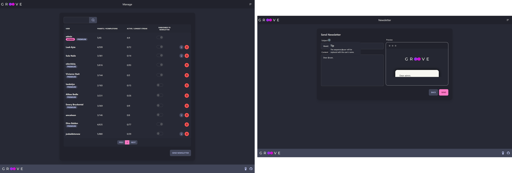

# Report: WebDSL Application

This report describes the application and its notable features. Furthermore it details my learning experience with WebDSL as well as a few thoughts on WebDSL in general.

## Groove - A Habit tracker

The application I set out to build is a habit tracker. The goal is to have a convenient way to keep track of habits and to motivate forming new habits with streaks. A user can have multiple habits, which in turn can be completed daily. Consecutive daily habit completions form streaks. This is the main concept and the application core. On top of that the application supports a variety of typical user flows such as signing up, resetting a forgotten password or verifying emails. On top of the basic features, premium users have an additional convenience feature. Furthermore, administrators can manage users and send newsletter emails to subscribers.

### Application Architecture

The application has the core entities `User`, `Habit` and `Completion`. The following diagram shows the entities in more detail. In terms of access control, the `User` is the principal with the email and password field. To verify emails and reset passwords a `Token` entity is used which has an id/token value and an expiry date. The completions store that on a given day the corresponding habit was completed. The absence of a completion in the database indicates that the habit was not completed on a given day. To make working with completions more convenient, the abstraction `Day` is introduced. This entity is not persisted but rather derived on request in a linear pass over all completions in the requested date range (`DateRange`). Caching the result of this linear pass did not work as then the value would sometimes be out of date.

### Application UI

In this section the user interface is described in more detail. The following image shows the habit page, the core of the application. On this page, users can select a range of dates for which the habit completions are shown (selected `DateRange` is stored in a session), complete and manage habits. Note the custom WebDSL input for the color selection. Not shown here is that non premium users cannot select all colors available to premium members.

The following images show the admin interface for managing users as well as writing newsletters.
In the user overview users can be promoted to premium users or deleted. Additionally, this page includes the WebDSL search functionality with pagination. The newsletter page includes a real-time preview. Note that all destructive actions need to be confirmed first.

Lastly the following image contains a few of the user flow screens. As the goal was to use WebDSL, the pages are often using placeholder text. Users can change their name, email, password and notification settings. On successful sign up, users are automatically sent a verification email. Moreover, users that are not yet verified can request a new verification email. The emails use a template that has a similar look to the rest of the application.

The core of the application (everything that needs users to be logged in), as well as the front page and login/signup pages, uses ajax and no full page reloads are required when navigating within those pages. Note that the browser history is changed on navigation. On successful actions, users often receive notifications. Since the built in `message` function does not play well with the use of ajax (notifications in short succession would replace old ones, which is not desired and the message rendering template needs to be refreshed manually), most pages use a custom notification system.

For the user interface I decided to go with a [`tailwindcss`](https://tailwindcss.com/) based approach using the components provided by [DaisyUI](https://daisyui.com/). This required an additional build step in order to generate the `.css` file before starting WebDSL.

## Learning WebDSL

According to my time tracking, I spend around 65 hours on part one of the assignment. Of this time, roughly 15 hours went into learning "basic" WebDSL. The entity system as well as static pages without ajax are straightforward and the majority of the time was spend looking at the documentation, `built-in.app` and codefinder. In this phase the main hold up were the slow `webdsl start` times as well as not knowing the syntactic details of WebDSL. Application wise, at this point the authentication flow (sign in, sign up, email verification, password reset requests, password changing) worked.

Soon after, I decided to try to use ajax in order to attempt the feel of a modern single page application. The goal was to have essentially no full page refreshes within the application. While I have not enough experience to know what is idiomatic WebDSL, I felt doing this was at the boundaries of what WebDSL was designed to do. Figuring out how to handle ajax in order to get this done took another 25 hours. When trying out different ways of using ajax to avoid refreshes, I ran into multiple confusing issues. Debugging those was not straightforward, as a lot of the time was spent making a minor change, waiting for the page to build and iterating until the cause of a particular issue was found. For example after hours of debugging I finally figured out that sometimes template references in functions are not correctly resolved, which turned out to be a unknown [bug](https://mattermost.tudelft.nl/cs4275-2122-q3/pl/tfcw7gh7u78apmzm64n9rzpxcc). Most of these 25 hours were spent debugging and waiting for `webdsl` instead of adding features to the application. I believe with more detailed documentation this time could easily be cut down to 5 hours.

## My two cents on WebDSL

Overall the DSL does its job quite well, especially the database abstraction was very convenient. Development is surprisingly straighforward and quick. However, the year being 2022, in terms of developer experience I found that using WebDSL does not spark joy. Here are some of the upsides, downsides and other thoughts on WebDSL

- The documentation is sometimes not up to date and uses deprecated, old and new syntax for code examples. I found this very annoying and thus used `built-in.app` and sometimes the generated `.java` files as main reference. Sometimes, the documentation does not mention things at all (e.g. how to change the favicon or what templates are available and can be overwritten). This is unfortunate as WebDSL offers many things, but if those are somewhat hidden it is as if they are not present. Codefinder often helps out where the documentation is lacking or has no example, but only if one knows a feature exists...
- Spoofax offers syntax highlighting and feedback which is especially helpful when getting started with WebDSL. However, inline XML, CSS and JS are not highlighted. Not too much of a hassle but still not as convenient as it could be. Personally I prefer and am more used do VSCode, so once I was used to the syntax I switched over. I have to say, that I find development more convenient now even without the editor feedback provided in eclipse. Initially I thought maybe I'll make a custom highlighter that will highlight the WebDSL keywords, but I forgot about that idea pretty quick.
- WebDSL is slow, especially when compared to other tools with hot reloading and almost instant feedback. This is a tremendous downside to WebDSL and probably the main reason I don't see myself using WebDSL to prototype some small projects in the future. I have to say that due to my setup I had extra steps such as compiling the css or killing of the tomcat instance still running in the background. In addition, due to some weird caching going on I found it most useful to almost always do a clean before starting, adding to the time. I did also not make the necessary changes on Windows to use the compile server. So that is probably not as bad as I've experienced it. Nevertheless, always waiting for tomcat is not fun.
- It would be nice if the documentation/examples included some larger fragments as I was not sure how to split the application into multiple files/directories. I think the way I have split up things makes mostly sense. However, some cyclic dependencies were not avoidable (e.g. when defining `User` and `Habit` in separate files the entities still need to know about each other).
- By trying to make a server side rendered single page application, I feel like I have pushed WebDSL in a direction it is not really meant to go. This was noticeable in the need to pass a LOT of context related things (e.g. placeholder ids) to children on multiple levels. The routing for example felt like writing boilerplate code again, which, given the purpose of WebDSL should not be the case. Here some more higher order capabilities (passing a function/ajax template as argument and/or currying) would help a lot. Note that I also tried using entities with attached functions, but those were not persisted between contexts unless saved in the database. Maybe with a dedicated session, one could actually already make highly interconnected ajax templates convenient to use (I did not want to rewrite the application again so I did not play around with that idea).
- Customizing thiings worked very well in most cases. For example creating a custom input (for the `Color` entity) and integrating Tailwind and DaisyUI was straightforward. Nevertheless it tooke some time to figure out where I need to look in order to find examples or the right function to do so. For example when trying to adjust the favicon, I found an [example using `includeHead` on codefinder](http://codefinder.org/viewFile/favicon/https%3A%5Es%5Esgithub.com%5Eswebdsl%5Eswebdsl%5Esblob%5Esmaster%5Estest%5Essucceed-web%5Esinclude.app/WebDSL#9), but that did not work for me. Without any help I would not have figured out that a specific set of static files can be placed in the `html` folder.

In summary, I did enjoy using WebDSL more than I anticipated. Nevertheless, the development experience is not up to par. Especially the long wait time made iterating slow. Hot reloading could make using WebDSL a lot more enjoyable. I don't know how that could be achieved, but for non database related things a full restart seems excessive.
Another thing I missed from other languages and tools was built in documentation. Typescript and Rust spoiled me a bit in this regard I guess. 
Would I use WebDSL in the future? I like the core idea, it makes some aspects of web development a lot faster/more convenient. If I don't want to use ajax or services (more on that in the report for assignment 2), then I doubt I can be faster using some other framework.
However, the tooling is slow and lacking. While the code is more efficient, using a traditional approach I would not have to wait for `webdsl start`. Sometimes that is not too bad, other times I feel like this holds me back too much. Debugging with `log` is very tedious. The documentation is incomplete, out of date and sometimes omits key details.